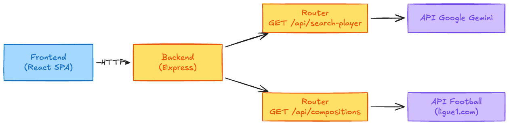
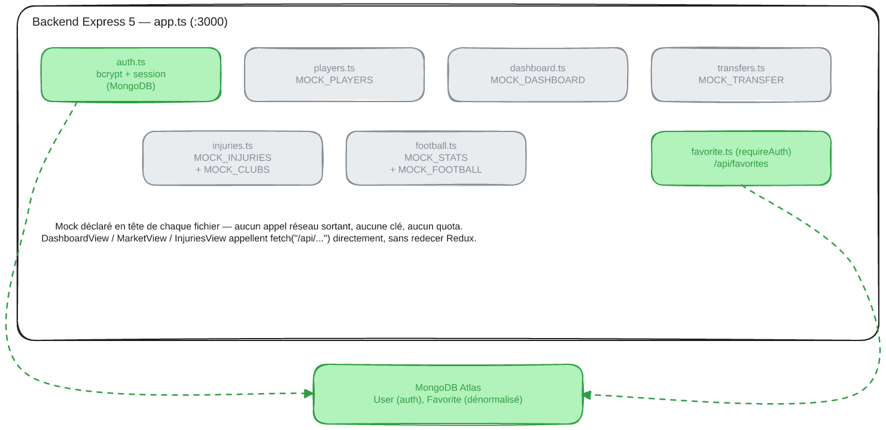
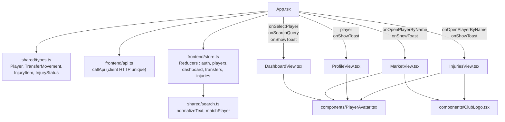
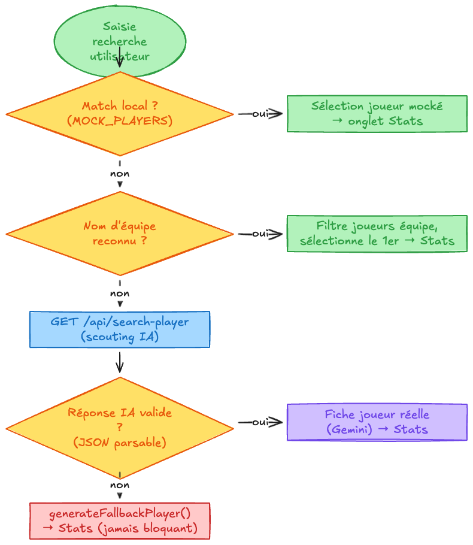
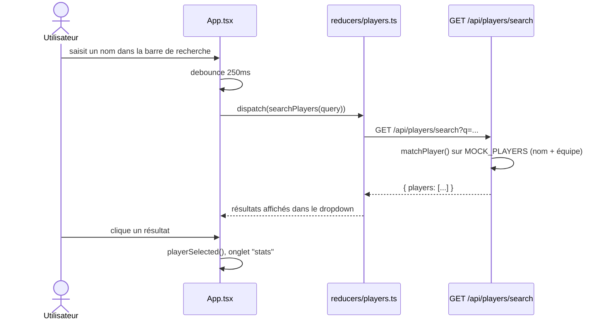
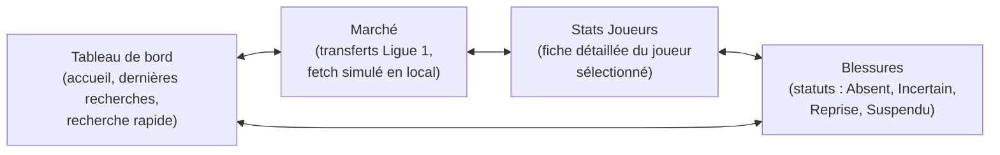

# MPG Companion

Compagnon de transferts et statistiques interactif pour manager MPG (Mon Petit Gazon) : tableau de bord, marché des transferts, fiches joueurs, suivi des blessures et authentification, limité à la Ligue 1.

## Stack technique

| Domaine         | Techno                                                                                    |
| ---------------- | ------------------------------------------------------------------------------------------ |
| Frontend        | React 19 + TypeScript, Vite, Tailwind CSS 4, Redux Toolkit                                |
| Backend         | Node.js + Express 5 (dev : `tsx backend/app.ts` en middleware Vite ; prod : sert `dist/`) |
| Auth / DB       | MongoDB Atlas + Mongoose. Token de session `uid2`, un seul appareil connecté à la fois     |
| Données football | Mock data — un router par écran, appelé en direct par `fetch()` depuis chaque View.tsx        |
| Icônes / anim   | lucide-react, motion                                                                       |
| Build           | Vite (client) + esbuild (bundle serveur `backend/app.ts` → `dist/server.cjs`)              |

## Démarrage local

**Prérequis :** Node.js, yarn

1. Installer les dépendances :
   ```bash
   yarn install
   ```
2. Copier `.env.example` en `.env` et renseigner :
   - `MONGODB_URI` — obligatoire, chaîne de connexion Atlas. C'est la seule variable requise :
     les routes football servent des mock data, sans clé ni quota.
3. Lancer frontend + backend ensemble :

   ```bash
   yarn dev
   ```
   - Frontend (Vite) : [http://localhost:3001](http://localhost:3001)
   - Backend (Express, API only) : [http://localhost:3000](http://localhost:3000)
   - Le frontend proxy automatiquement les appels `/api/*` vers le backend (`vite.config.ts`) — pas de souci CORS, pas de config manuelle.

   Pour lancer séparément (2 terminaux, utile pour isoler les logs) :

   ```bash
   yarn dev:api   # backend seul, port 3000
   yarn dev:web   # frontend seul, port 3001
   ```

4. Build prod puis lancement :
   ```bash
   yarn build
   yarn start
   ```
   En prod, un seul serveur Express sert le build statique `dist/` (plus de split de ports).

Sans `MONGODB_URI`, le serveur ne démarre pas : la connexion Mongo est attendue avant l'ouverture du port, pour éviter des erreurs d'auth obscures plutôt qu'un message clair au lancement.

## Commandes disponibles

| Commande            | Effet                                                              |
| -------------------- | -------------------------------------------------------------------- |
| `yarn dev`          | Lance frontend (Vite) et backend (Express) en parallèle            |
| `yarn dev:api`      | Lance uniquement le serveur Express (`tsx backend/app.ts`), port 3000 |
| `yarn dev:web`      | Lance uniquement Vite, port 3001                                   |
| `yarn build`        | Build client (Vite) + bundle serveur (esbuild → `dist/server.cjs`) |
| `yarn start`        | Lance le build de production (`node dist/server.cjs`)              |
| `yarn preview`      | Prévisualise le build Vite en local                                |
| `yarn clean`        | Supprime `dist/` et `server.js`                                    |
| `yarn typecheck`    | Vérifie les types TypeScript (`tsc --noEmit`), sans build          |
| `yarn lint`         | `typecheck` + ESLint (`eslint .`) sur tout le projet               |
| `yarn lint:fix`     | Applique les corrections ESLint automatiques (`eslint . --fix`)    |
| `yarn format`       | Reformate tous les fichiers avec Prettier (`prettier --write .`)   |
| `yarn format:check` | Vérifie le formatage sans modifier les fichiers, utile en CI       |

## System design

### 0. Schéma simplifié — flux Frontend / Backend / APIs

Le frontend parle au backend Express (`/api/*`) pour tout : l'auth et la recherche joueurs via `callApi`, Dashboard/Marché/Blessures via un `fetch()` direct dans chaque View.tsx.



_Diagramme Excalidraw — source éditable : [docs/diagrams/schema-simple.excalidraw](docs/diagrams/schema-simple.excalidraw)_

### 1. Architecture globale

`auth.ts` et `favorite.ts` parlent à MongoDB (`User`, `Favorite`). Chaque route data (`players.ts`, `dashboard.ts`, `transfers.ts`, `injuries.ts`, `football.ts`) répond avec le mock déclaré en tête de fichier (`MOCK_PLAYERS`, `MOCK_DASHBOARD`, `MOCK_TRANSFER`, `MOCK_INJURIES`, `MOCK_STATS`/`MOCK_FOOTBALL`) : aucun appel réseau sortant, aucune dépendance externe. `DashboardView`, `MarketView`, `InjuriesView` et `ProfileView` (favoris) les appellent avec un `fetch()` direct — pas de Redux, pas de `callApi` pour celles-là. `favorite.ts` est monté deux fois dans `app.ts` (`/api/favourites` et `/api/favorites`) ; seule la seconde route sert réellement, la première est morte.



_Diagramme Excalidraw — source éditable : [docs/diagrams/architecture-globale.excalidraw](docs/diagrams/architecture-globale.excalidraw)_

### 2. Composants frontend et données partagées



### 3. Flux : recherche globale d'un joueur

Recherche servie par `backend/routes/players.ts` (`MOCK_PLAYERS`) — plus d'appel IA externe. Le débounce de 250ms évite un aller-retour serveur par caractère tapé.



_Diagramme Excalidraw — source éditable : [docs/diagrams/flux-recherche.excalidraw](docs/diagrams/flux-recherche.excalidraw)_

<details>
<summary>Version séquence (Mermaid)</summary>



</details>

### 4. Vues (onglets) de l'application



## Structure du projet

```
mpg-companion/
├── shared/
│   ├── types.ts                   # Types partagés front/back (Player, TransferMovement, InjuryItem, ...)
│   └── search.ts                  # normalizeText, matchPlayer (recherche insensible aux accents)
├── backend/
│   ├── app.ts                     # Express, connexion Mongo, montage des routes, écoute du port
│   ├── models/
│   │   ├── User.ts                # email, passwordHash, token de session
│   │   ├── Favorite.ts            # user (ref), playerId + champs joueur dénormalisés, index unique {user, playerId}
│   │   └── connection.ts          # Connexion Mongoose (effet de bord à l'import)
│   └── routes/
│       ├── auth.ts                # bcrypt + gardes de session + signup/signin/session/logout
│       ├── football.ts            # GET /health, /stats, /players — MOCK_STATS, MOCK_FOOTBALL en tête de fichier
│       ├── players.ts             # GET /search, GET /:id — MOCK_PLAYERS en tête de fichier
│       ├── dashboard.ts           # GET / — MOCK_DASHBOARD en tête de fichier
│       ├── transfers.ts           # GET / — MOCK_TRANSFER en tête de fichier
│       ├── injuries.ts            # GET / — MOCK_INJURIES + MOCK_CLUBS en tête de fichier
│       └── favorite.ts            # GET/POST /, DELETE /:playerId — requireAuth
├── frontend/
│   ├── App.tsx                    # État global, navigation (react-router-dom), recherche
│   ├── api.ts                     # callApi : client HTTP unique, utilisé par auth et players
│   ├── index.tsx
│   ├── store.ts                   # configureStore + hooks typés (auth, players)
│   ├── reducers/
│   │   ├── auth.ts                  # slice + thunks signup/signin/logout/fetchSession
│   │   └── players.ts               # slice + thunk searchPlayers
│   ├── SessionRestorer.tsx        # relit la session au démarrage
│   ├── auth/
│   │   ├── useAuth.ts               # Hook au-dessus du store Redux
│   │   └── LoginModal.tsx           # Connexion / inscription
│   └── components/                # DashboardView, MarketView, ProfileView, InjuriesView,
│                                   # ViewState, PlayerAvatar, ClubLogo
├── docs/diagrams/                 # Sources .excalidraw + PNG exportés (ce README)
└── wireframes/                    # PDFs wireframes + UI kit
```

## Notes d'implémentation

- **Authentification** : email + mot de passe, bcrypt (12 tours). Le token (`uid2`, 32 octets) vit sur `User.token`, régénéré à chaque connexion — une seule session active par compte. Au logout, le champ est retiré avec `$unset` (jamais `$set null` : l'index `token` est unique+sparse, et `null` compterait comme présent).
- **Fetch direct dans les View.tsx** : `DashboardView`, `MarketView` et `InjuriesView` n'ont ni reducer Redux ni module mock local — chacune fait `fetch("/api/...")` dans un `useEffect`, avec `.then((res) => res.json()).then((data) => ...)`, `useState` local pour la donnée/`loading`/`error`, et un bouton retry qui relance le même fetch. Un seul casting de trois joueurs — Dembélé (Paris Saint Germain), David (Lille), Lacazette (Lyon) — est repris à l'identique dans tous les routers, ce qui rend les écrans recoupables d'un coup d'œil. L'orthographe des clubs doit rester identique d'un fichier à l'autre.
- **Contrat de réponse** : `{ topPlayers }`, `{ transfers }`, `{ injuries, clubs }`. `clubs` doit commencer par `"Tous les clubs"` (état initial du filtre). Côté marché, `amount: "—"` signifie « montant inconnu » et `statusLabel` doit être pris dans les libellés reconnus par `MarketView`.
- **Recherche** (`frontend/reducers/players.ts`) : `GET /api/players/search?q=` compare nom et équipe (`matchPlayer` de `shared/search.ts`) sur les mock data, débattue à 250ms pendant la frappe.
- **Token côté client** : stocké en `localStorage`, pas de cookie. Auth et recherche passent par `callApi` (`frontend/api.ts`) ; Dashboard/Marché/Blessures/Favoris font un `fetch` nu.
- **Favoris** : `ProfileView.tsx` fait un `fetch` nu vers `/api/favorites`, état local (pas de reducer Redux). Sans session, le toggle appelle `requestLogin()` sans atteindre le réseau. Le model `Favorite` dénormalise les champs joueur (pas de `populate`) : à garder synchrone avec `Player` si sa forme change.

## Note sur cette documentation

L'architecture globale et les flux sont dessinés avec le toolkit Excalidraw (`mcp-excalidraw-server`, schéma local sur `http://127.0.0.1:3005` — le port 3000 est déjà pris par le backend en dev). Les sources éditables `.excalidraw` sont versionnées dans [docs/diagrams/](docs/diagrams/) — importez-les dans le canvas (`import <fichier>.excalidraw`) pour les modifier, puis ré-exportez le PNG. Les diagrammes des composants frontend et des vues restent en Mermaid (natif dans GitHub et la plupart des visualiseurs Markdown).
