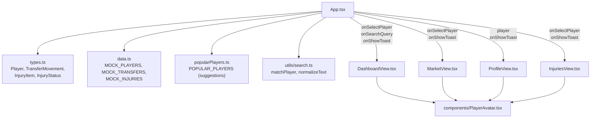
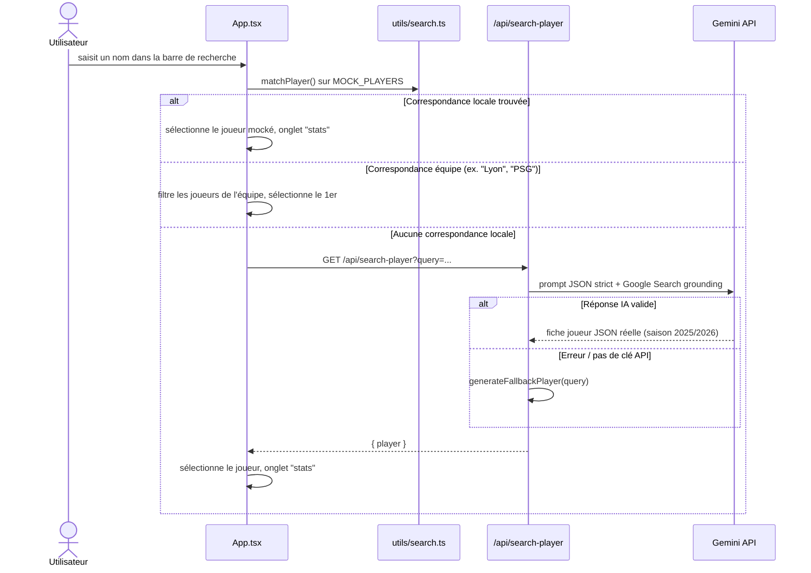
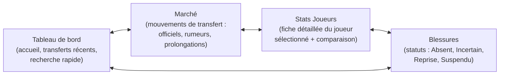

# MPG Companion

Compagnon de transferts et statistiques interactif pour manager MPG (Mon Petit Gazon) : tableau de bord, marché des transferts, fiches joueurs (scoutées par IA) et suivi des blessures, pour votre ligue.

## Stack technique

| Domaine | Techno |
|---|---|
| Frontend | React 19 + TypeScript, Vite, Tailwind CSS 4 |
| Backend | Node.js + Express (mode dev : middleware Vite ; prod : fichiers statiques `dist/`) |
| IA | Google GenAI SDK (`@google/genai`, modèle Gemini) avec Google Search grounding |
| Icônes / anim | lucide-react, motion |
| Build | Vite (client) + esbuild (bundle serveur `server.ts` → `dist/server.cjs`) |

## Démarrage local

**Prérequis :** Node.js

1. Installer les dépendances : `npm install`
2. Renseigner `GEMINI_API_KEY` dans `.env`
3. Lancer en dev : `npm run dev` (tsx exécute `server.ts`, qui monte Vite en middleware)
4. Build prod : `npm run build` puis `npm start`

Sans `GEMINI_API_KEY`, l'app reste utilisable : le backend bascule sur un générateur de joueur fictif (`generateFallbackPlayer`) pour ne jamais casser l'expérience.

## System design

### 0. Schéma simplifié — flux Frontend / Backend / APIs


*Diagramme Excalidraw — source éditable : [docs/diagrams/schema-simple.excalidraw](docs/diagrams/schema-simple.excalidraw)*

### 1. Architecture globale


*Diagramme Excalidraw — source éditable : [docs/diagrams/architecture-globale.excalidraw](docs/diagrams/architecture-globale.excalidraw)*

### 2. Composants frontend et données statiques



### 3. Flux : recherche globale d'un joueur


*Diagramme Excalidraw — source éditable : [docs/diagrams/flux-recherche.excalidraw](docs/diagrams/flux-recherche.excalidraw)*

<details>
<summary>Version séquence (Mermaid)</summary>



</details>

### 4. Vues (onglets) de l'application



## Structure du projet

```
mpg-companion/
├── server.ts                  # Serveur Express : API IA + scraping compositions
├── src/
│   ├── App.tsx                 # État global, navigation, recherche, modales
│   ├── main.tsx                # Point d'entrée React
│   ├── types.ts                # Types partagés (Player, InjuryItem, ...)
│   ├── data.ts                 # Données mockées (joueurs, transferts, blessures)
│   ├── popularPlayers.ts        # Liste de suggestions pour l'autocomplétion
│   ├── utils/search.ts          # Matching de joueurs (insensible aux accents)
│   └── components/
│       ├── DashboardView.tsx
│       ├── MarketView.tsx
│       ├── ProfileView.tsx
│       ├── InjuriesView.tsx
│       └── PlayerAvatar.tsx
├── wireframes/                 # PDFs de wireframes et UI kit
└── dist/                       # Build de production (généré)
```

## Notes d'implémentation

- **Résilience recherche IA** : toute erreur (parsing JSON, API indisponible, pas de clé) retombe sur `generateFallbackPlayer`, jamais d'écran d'erreur bloquant côté utilisateur.
- **Cache compositions** : `GET /api/compositions` scrape `ligue1.com` avec retry/backoff sur 502/503, cache 6h en mémoire, et sert une donnée périmée (`stale: true`) plutôt qu'une erreur si le site est indisponible.
- **Recherche multi-niveaux** : nom de joueur local → nom d'équipe (mapping vers noms standardisés) → scouting IA distant, dans cet ordre de priorité pour limiter les appels API.

## Note sur cette documentation

L'architecture globale et le flux de recherche sont dessinés avec le toolkit Excalidraw (`mcp-excalidraw-server`, canvas local sur `http://127.0.0.1:3005`). Les sources éditables `.excalidraw` sont versionnées dans [docs/diagrams/](docs/diagrams/) — importez-les dans le canvas (`import <fichier>.excalidraw`) pour les modifier, puis ré-exportez le PNG. Les diagrammes des composants frontend et des vues restent en Mermaid (natif dans GitHub et la plupart des visualiseurs Markdown).
