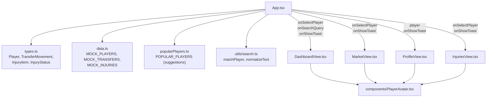
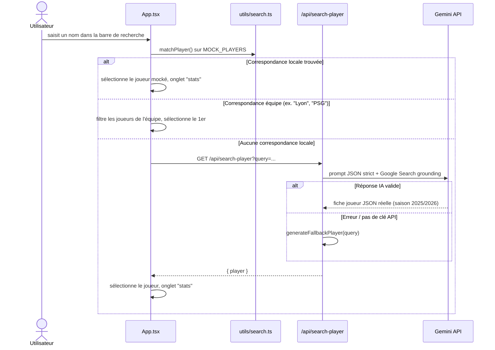
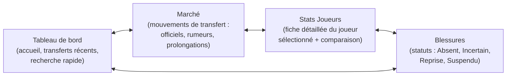

# MPG Companion

Compagnon de transferts et statistiques interactif pour manager MPG (Mon Petit Gazon) : tableau de bord, marché des transferts, fiches joueurs (scoutées par IA) et suivi des blessures, pour votre ligue.

## Stack technique

| Domaine       | Techno                                                                                         |
| ------------- | ---------------------------------------------------------------------------------------------- |
| Frontend      | React 19 + TypeScript, Vite, Tailwind CSS 4                                                    |
| Backend       | Node.js + Express (mode dev : serveur API dédié port 3000 ; prod : fichiers statiques `dist/`) |
| IA            | Google GenAI SDK (`@google/genai`, modèle Gemini) avec Google Search grounding                 |
| Icônes / anim | lucide-react, motion                                                                           |
| Build         | Vite (client) + esbuild (bundle serveur `server.ts` → `dist/server.cjs`)                       |

## Démarrage local

**Prérequis :** Node.js, yarn

1. Installer les dépendances :
   ```bash
   yarn install
   ```
2. Renseigner les variables d'environnement dans `.env` (`GEMINI_API_KEY`, `PROJECT_URL_SUPABASE`, `SUPABASE_KEY`).
3. Lancer frontend + backend ensemble :

   ```bash
   yarn dev
   ```
   - Frontend (Vite) : [http://localhost:3001](http://localhost:3001)
   - Backend (Express, API only) : [http://localhost:3000](http://localhost:3000)
   - Le frontend proxy automatiquement les appels `/api/*` vers le backend (`vite.config.ts`) — pas de souci CORS, pas de config manuelle.

   Pour lancer séparément (2 terminaux, utile pour isoler les logs) :

   ```bash
   yarn dev:api   # backend seul, port 3000
   yarn dev:web   # frontend seul, port 3001
   ```

4. Build prod puis lancement :
   ```bash
   yarn build
   yarn start
   ```
   En prod, un seul serveur Express sert le build statique `dist/` (plus de split de ports).

Sans `GEMINI_API_KEY`, l'app reste utilisable : le backend bascule sur un générateur de joueur fictif (`generateFallbackPlayer`) pour ne jamais casser l'expérience.

## Commandes disponibles

| Commande            | Effet                                                              |
| ------------------- | ------------------------------------------------------------------ |
| `yarn dev`          | Lance frontend (Vite) et backend (Express) en parallèle            |
| `yarn dev:api`      | Lance uniquement le serveur Express (`tsx server.ts`), port 3000   |
| `yarn dev:web`      | Lance uniquement Vite, port 3001                                   |
| `yarn build`        | Build client (Vite) + bundle serveur (esbuild → `dist/server.cjs`) |
| `yarn start`        | Lance le build de production (`node dist/server.cjs`)              |
| `yarn preview`      | Prévisualise le build Vite en local                                |
| `yarn clean`        | Supprime `dist/` et `server.js`                                    |
| `yarn typecheck`    | Vérifie les types TypeScript (`tsc --noEmit`), sans build          |
| `yarn lint`         | `typecheck` + ESLint (`eslint .`) sur tout le projet               |
| `yarn lint:fix`     | Applique les corrections ESLint automatiques (`eslint . --fix`)    |
| `yarn format`       | Reformate tous les fichiers avec Prettier (`prettier --write .`)   |
| `yarn format:check` | Vérifie le formatage sans modifier les fichiers, utile en CI       |

## System design

### 0. Schéma simplifié — flux Frontend / Backend / APIs


_Diagramme Excalidraw — source éditable : [docs/diagrams/schema-simple.excalidraw](docs/diagrams/schema-simple.excalidraw)_

### 1. Architecture globale


_Diagramme Excalidraw — source éditable : [docs/diagrams/architecture-globale.excalidraw](docs/diagrams/architecture-globale.excalidraw)_

### 2. Composants frontend et données statiques



### 3. Flux : recherche globale d'un joueur


_Diagramme Excalidraw — source éditable : [docs/diagrams/flux-recherche.excalidraw](docs/diagrams/flux-recherche.excalidraw)_

<details>
<summary>Version séquence (Mermaid)</summary>



</details>

### 4. Vues (onglets) de l'application



## Structure du projet

```
mpg-companion/
├── backend/
│   ├── server.ts                # Entrée serveur Express (dev + prod)
│   ├── app.ts                   # Config Express, routes, endpoint IA + compositions
│   ├── supabase.ts              # Client Supabase (cookies, RLS)
│   ├── middleware/               # requireAuth, rateLimit, errorHandler
│   ├── routes/                   # auth.ts, favorites.ts
│   ├── utils/asyncHandler.ts
│   ├── api/index.ts              # Entrée serverless Vercel
│   └── supabase/migrations/      # Migrations SQL
├── frontend/
│   ├── App.tsx                   # État global, navigation, recherche, modales
│   ├── main.tsx                  # Point d'entrée React
│   ├── types.ts                  # Types partagés (Player, InjuryItem, ...)
│   ├── data.ts                   # Données mockées (joueurs, transferts, blessures)
│   ├── popularPlayers.ts         # Liste de suggestions pour l'autocomplétion
│   ├── utils/search.ts           # Matching de joueurs (insensible aux accents)
│   ├── auth/                     # AuthContext, LoginModal
│   ├── favorites/                # FavoritesContext
│   └── components/
│       ├── DashboardView.tsx
│       ├── MarketView.tsx
│       ├── ProfileView.tsx
│       ├── InjuriesView.tsx
│       ├── FavoritesView.tsx
│       ├── FavoriteButton.tsx
│       └── PlayerAvatar.tsx
├── wireframes/                  # PDFs de wireframes et UI kit
└── dist/                        # Build de production (généré)
```

## Notes d'implémentation

- **Résilience recherche IA** : toute erreur (parsing JSON, API indisponible, pas de clé) retombe sur `generateFallbackPlayer`, jamais d'écran d'erreur bloquant côté utilisateur.
- **Cache compositions** : `GET /api/compositions` scrape `ligue1.com` avec retry/backoff sur 502/503, cache 6h en mémoire, et sert une donnée périmée (`stale: true`) plutôt qu'une erreur si le site est indisponible.
- **Recherche multi-niveaux** : nom de joueur local → nom d'équipe (mapping vers noms standardisés) → scouting IA distant, dans cet ordre de priorité pour limiter les appels API.

## Note sur cette documentation

L'architecture globale et le flux de recherche sont dessinés avec le toolkit Excalidraw (`mcp-excalidraw-server`, canvas local sur `http://127.0.0.1:3005`). Les sources éditables `.excalidraw` sont versionnées dans [docs/diagrams/](docs/diagrams/) — importez-les dans le canvas (`import <fichier>.excalidraw`) pour les modifier, puis ré-exportez le PNG. Les diagrammes des composants frontend et des vues restent en Mermaid (natif dans GitHub et la plupart des visualiseurs Markdown).
